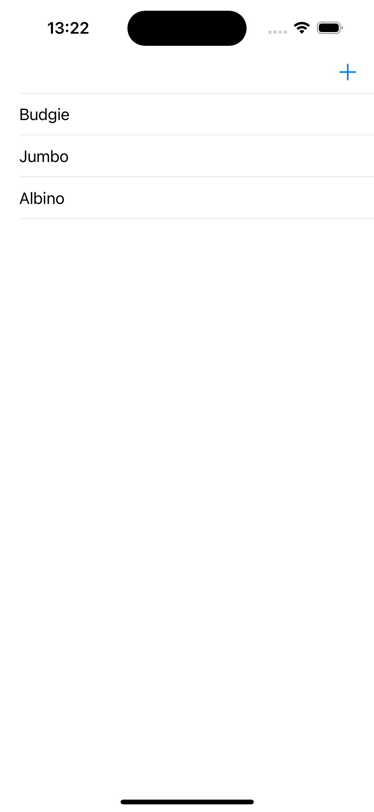
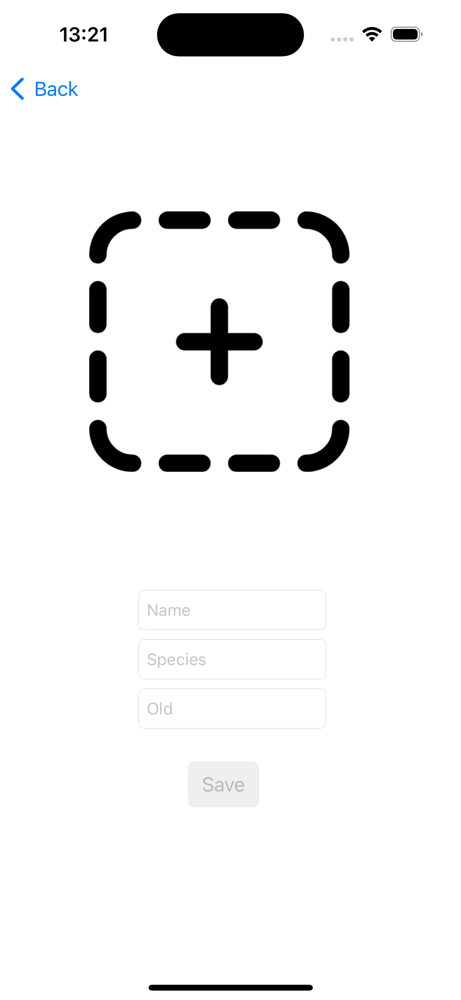

# The Bird Gallery

User can add a bird to gallery. A bird entity has image, name, species and old parameters. Birds stored in CoreData, also visible in TableView.

# App Screenshots

| Home Screen | Add Bird |
|----------|----------|
|  |  |

